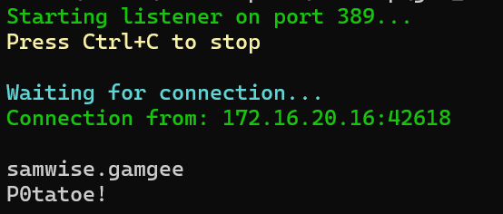

# PowerShell_Passback
PowerShell script to receive authentication when performing a Passback Attack. Why would you use this? Imagine you're in a segmented network and cannot get traffic back to yourself, you can only send traffic in. Perfect. Run this suttle program on a host you control and perform a Passback attack using it.

